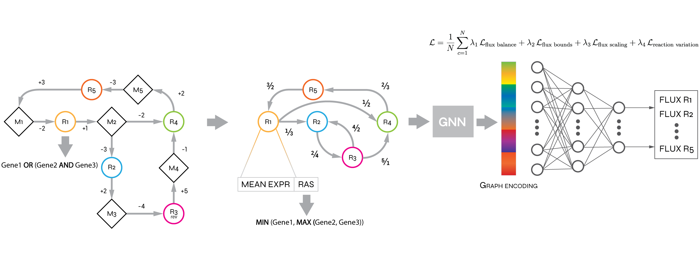

# MasterThesis-MetabolicFluxPrediction
This repository contains a public overview of my MSc thesis, which focuses on predicting metabolic fluxes using Graph Neural Networks (GNNs).

The goal of this work was to develop a graph-based deep learning approach to estimate reaction fluxes in genome-scale metabolic models. We designed and trained a GNN model that incorporates stoichiometric information, gene expression data, and network topology.

## 📂 Files

- `abstract.pdf`: One-page summary of the thesis
- `summary.pdf`: A more detailed overview
- `slides.pdf`: Thesis defense slides

## 🚧 Note

This repository contains only public content. The full code and implementation remain private for now due to possible future publications and ongoing work.

## 🧑‍💻 Author

Fabio Marini [@fabbio00](https://github.com/fabbio00)

## 📅 Date

Thesis defended in March 2025 at Università degli Studi di Milano Bicocca
